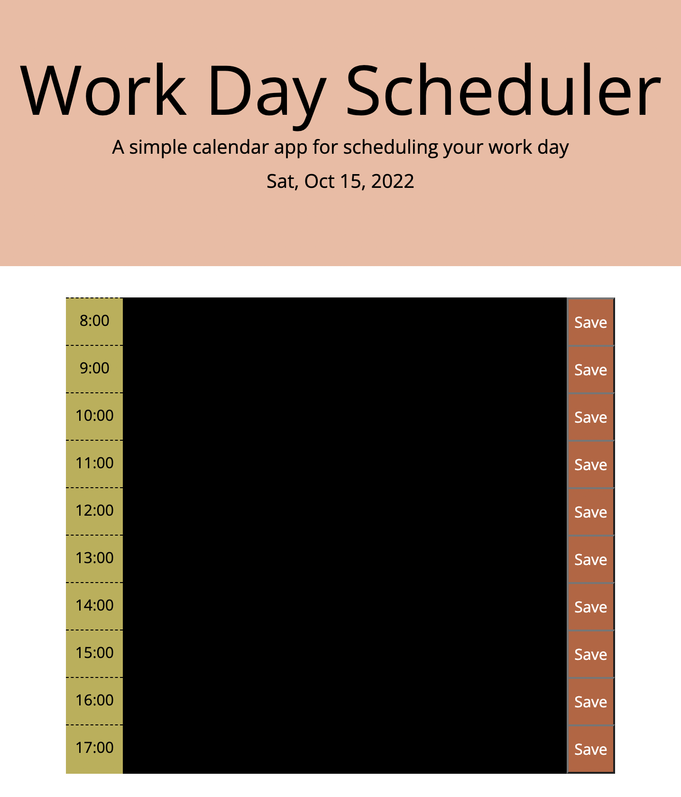

# don-t_forget

## Description

In this project, I made a work scheduler from 8am to 5pm.
Start code was given for html/stylesheet, and have to build javascript code.

Each work schedule will be color coded based on the current time in three way: past, current, future.
Also, save button will let the works saved to local storage so it can remain after refresh.

## Screenshot

## Deployed application link
https://d0kd0.github.io/don-t_forget